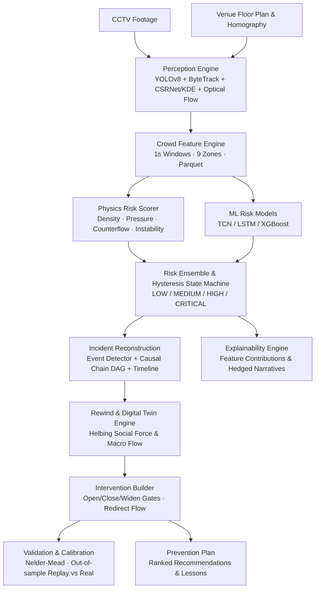

# REWIND — AI Incident Reconstruction & Prevention Engine

> *"Reconstruct the past. Simulate the alternative."*

[](https://github.com/SagnickInTheShell/Rewind/actions)
[](https://www.python.org/downloads/)
[](https://react.dev/)
[](https://fastapi.tiangolo.com/)
[](LICENSE)

---

## 1. Overview

REWIND transforms uploaded CCTV footage of a crowd and a venue floor plan into an explainable, interactive digital twin that addresses the four critical questions of crowd incident investigation:

1. **Where did it begin?** Identifies the root origin zone and timestamp of an escalating surge.
2. **What made it escalate?** Breaks down physical contributors (density, bottleneck pressure, counterflow, turbulence) with exact feature contributions and natural language narratives.
3. **What could have been done differently?** Lets operators **rewind** to any moment prior to peak escalation and apply architectural or procedural interventions (e.g., open side exits, restrict incoming flow, widen portals, redirect streams).
4. **Would redistributing the crowd have helped?** Simulates alternative scenarios side-by-side at 60 fps using continuous Helbing social-force or fast macro-flow models, validated against real footage.

---

## 2. Architecture & Pipeline



### Data Pipeline Stages
- **Perception**: Sparse/dense hybrid tracking (YOLO person detections & ByteTrack when sparse; CSRNet density map or Gaussian KDE fallback and Farneback optical flow when dense).
- **Feature Extraction**: $1\,\text{s}$ non-overlapping window features per zone: density, mean/variance velocity, direction entropy, counterflow index, bottleneck pressure, and crowd pressure (turbulence).
- **Scoring**: Explainable physics-based scoring combined with temporal ML models via an ensemble with debounced hysteresis states.
- **Reconstruction**: Causal DAG linking origin events to peak risk with a 2–3 sentence natural language timeline.
- **Simulation**: Digital twin simulation from initial state at $t_0$ applying user interventions, emitting identical timeseries contracts.

---

## 3. Tech Stack

- **Backend**: Python 3.11, FastAPI, Pydantic v2, PyTorch, Ultralytics YOLOv8, ByteTrack (supervision), OpenCV, NumPy, SciPy, NetworkX, Polars/PyArrow.
- **Frontend**: React 18, TypeScript (strict mode), Vite, Tailwind CSS, Zustand, TanStack Query, Recharts, Lucide Icons.
- **Testing**: Pytest (153 unit & integration tests), Vitest (20 tests), Hypothesis property tests, Ruff, Mypy.

---

## 4. Quick Start

### Prerequisites
- Python 3.11+
- Node.js 20+ & npm

### Native Windows Setup
```powershell
# 1. Setup virtual environment and dependencies
powershell -File scripts/dev.ps1 setup

# 2. Generate pre-computed demo run & simulations
powershell -File scripts/dev.ps1 demo

# 3. Start development servers (Backend :8000, Frontend :5173 / :5175)
powershell -File scripts/dev.ps1 dev
```

### Linux / macOS / Docker Setup
```bash
# Setup
make setup

# Generate demo dataset
make demo

# Launch both apps
make dev
```

### Docker Compose
```bash
docker compose up --build
```
Open **`http://localhost:5173`** (or the port indicated in Vite output) and click **"Demo"** in the top navigation bar.

---

## 5. Adding Venues & Camera Calibration

1. **Venue Specification**: Create a JSON file in `data/venues/{venue_id}.json` specifying bounds, zones ($A1 \dots C3$), portals, walls, sources, and sinks.
2. **Homography Calibration**: Use the **Calibration Helper** in the Upload UI:
   - Mark $\ge 4$ ground points on the CCTV video frame.
   - Map each to corresponding world coordinates $(x, y)$ in metres on the venue floor plan.
   - The system computes homography via RANSAC with projective area scaling.

---

## 6. Model Details & Performance

### Crowd Dynamics Metrics
- **Crowd Pressure (Helbing 2007)**: $P = \rho \cdot \operatorname{Var}(v)$, quantifying turbulent energy dissipation in dense crowds.
- **Bottleneck Pressure**: Ratio of incoming flow to outgoing portal capacity: $\frac{Q_{\text{in}}}{\sum w \cdot c}$.
- **Counterflow Index**: Fraction of velocity vectors oriented $\ge 120^\circ$ against the dominant stream.

### Model Performance
- **Validation**: Out-of-sample Nelder–Mead calibration on first 50% window; tested on non-overlapping evaluation window.
  - Overall Density RMSE: **$0.127\,\text{p/m}^2$**
  - Risk State Agreement: **$92\%$**
  - Verdict: **GOOD**
- **Simulation Speed**: Macro flow model runs 5 scenarios $\times$ 3 seeds in $< 2\,\text{s}$. Social force microscopic model runs $1{,}000$ agents $\times$ $60\,\text{s}$ at $60\,\text{fps}$ playback.

---

## 7. Ethical Positioning & Privacy by Design

- **Decision Support**: REWIND does **not** claim to foresee mass surges or eliminate incidents. The system identifies escalating risk patterns in crowd dynamics and estimates how interventions could change modelled outcomes under specified assumptions.
- **Caveat**: All outputs carry the mandatory notice: *"Simulation output under modelled assumptions. Not a guarantee of real-world outcomes. Intended to support, not replace, trained crowd-safety professionals."*
- **Privacy**: No facial recognition, biometric identity extraction, or cross-camera tracking is performed. Track IDs are anonymous and scoped strictly to a single processing run. Privacy head/face blurring is enabled by default on exports.

---

## 8. Acknowledgements & References

- **Helbing, D., Johansson, A., & Al-Abideen, H. Z. (2007)**: *Dynamics of crowd disasters: An empirical study.* Physical Review E, 75(4), 046109.
- **Li, Y., Zhang, X., & Chen, D. (2018)**: *CSRNet: Dilated convolutional neural networks for understanding the highly congested scenes.* CVPR.
- **Zhang, Y. et al. (2022)**: *ByteTrack: Multi-Object Tracking by Associating Every Detection Box.* ECCV.
- **Ultralytics**: YOLOv8 real-time object detection framework.
