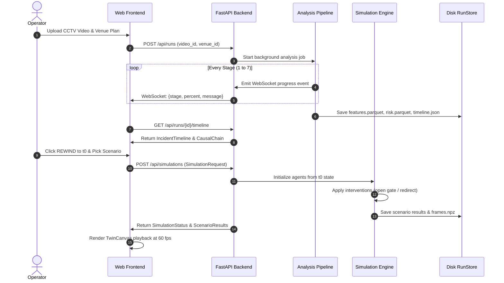

# REWIND — System Architecture & Technical Specifications

This document outlines the architectural blueprints, data flow, contract schemas, and modular design of the **REWIND** AI Incident Reconstruction & Prevention Engine.

---

## 1. High-Level Architecture

```mermaid
graph TB
    subgraph Client ["Frontend (React 18 + TypeScript + Vite)"]
        UI_Home[Home Dashboard]
        UI_Analyze[Analysis Player & Overlay]
        UI_Rewind[Digital Twin & Scenario Builder]
        UI_Insights[Prevention Plan & Validation]
        ZStore[Zustand Time & Session Store]
        TClient[Typed API Client & TanStack Query]
    end

    subgraph Server ["Backend (FastAPI + Python 3.11)"]
        API[FastAPI Endpoints]
        JobManager[Async Job Manager & WebSocket Events]
        RunStore[RunStore File-Backed Cache]
    end

    subgraph Perception ["Perception & Feature Pipeline"]
        VReader[VideoReader & Ingest]
        Detector[YOLOv8 Person Detector]
        Tracker[ByteTrack Multi-Object Tracker]
        DensityKDE[CSRNet / Gaussian KDE Fallback]
        Flow[Farneback Optical Flow]
        Fusion[Hybrid Sparse/Dense Fusion]
        FEngine[Crowd Metric & Zone Feature Engine]
    end

    subgraph RiskRecon ["Risk & Reconstruction Engine"]
        PhysScorer[Physics Risk Scorer]
        MLEnsemble[TCN / LSTM / XGBoost Ensemble]
        Hysteresis[Hysteresis & Debounce State Machine]
        EventDet[Event Detector]
        CausalDAG[Causal Chain Weighted DAG]
        Narrator[Hedged Narrative Generator]
    end

    subgraph SimTwin ["Simulation & Validation Engine"]
        SFEngine[Helbing Continuous Social Force Model]
        MacroEngine[Fast Macro Flow Model]
        SpatialHash[O(N) Spatial Hashing Grid]
        Router[Congestion Venue Graph Router]
        Replay[Do-Nothing Replay Engine]
        Calibrator[Nelder-Mead Parameter Calibrator]
        StrategyRanker[Prevention Strategy Ranker]
    end

    Client <-->|REST + WebSocket| Server
    Server --> Perception
    Perception --> RiskRecon
    RiskRecon --> SimTwin
    SimTwin --> RunStore
    RiskRecon --> RunStore
    Perception --> RunStore
```

---

## 2. Pipeline Execution Flow



---

## 3. Data Contracts & Interfaces

1. **`ZoneFeatures` (`features.parquet`)**: The central contract connecting perception with risk and simulation. Contains 1s window density, velocity mean/variance, direction entropy, counterflow index, bottleneck pressure, and crowd pressure per zone.
2. **`RiskPoint` & `GlobalRisk` (`risk.parquet`, `global_risk.parquet`)**: Ensemble scores with hysteresis state (LOW, MEDIUM, HIGH, CRITICAL).
3. **`IncidentTimeline` (`timeline.json`)**: Reconstructed events (ENTRY_SURGE, BOTTLENECK, COUNTERFLOW, INSTABILITY, PEAK_RISK) linked by causal predecessor references.
4. **`ScenarioResult` (`results.json`)**: Metrics for each simulated intervention scenario across seeds (peak density, time in critical, seed standard deviation).
5. **`ValidationReport` (`validation.json`)**: Out-of-sample calibration error (RMSE, correlation, state agreement, verdict).

---

## 4. Hardware Optimization & Scaling

- **GPU Acceleration**: YOLOv8 inference runs with FP16 batched execution on CUDA.
- **Microscopic Social Force**: Vectorized NumPy operations accelerated by spatial hashing grid ($O(N)$ neighborhood lookups) ensuring $1{,}000$ agents simulate in $< 60\,\text{s}$ CPU time.
- **Macroscopic Flow**: Discrete graph flow sweeps for rapid previewing ($< 2\,\text{s}$ for 5 scenarios).
- **Client Playback**: Float16 binary frame payloads decoded with `DataView` for 60 fps client rendering.
